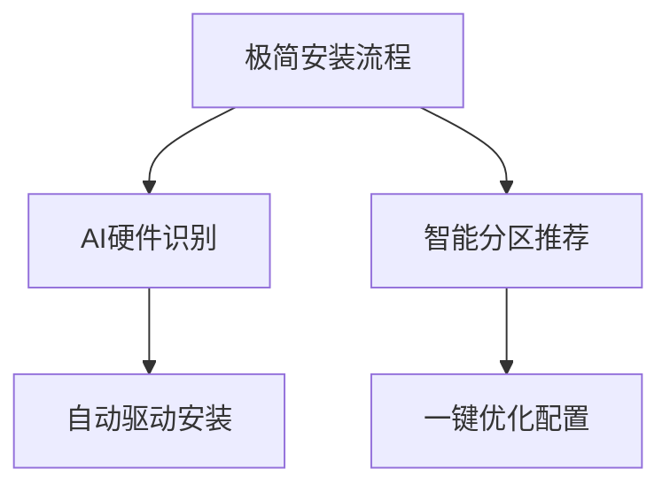
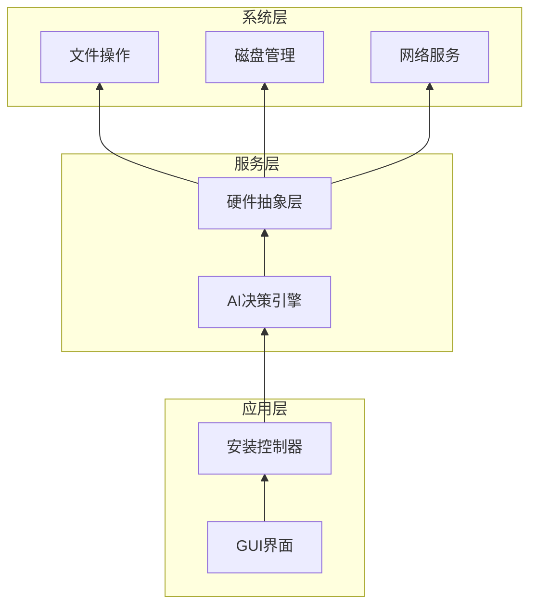
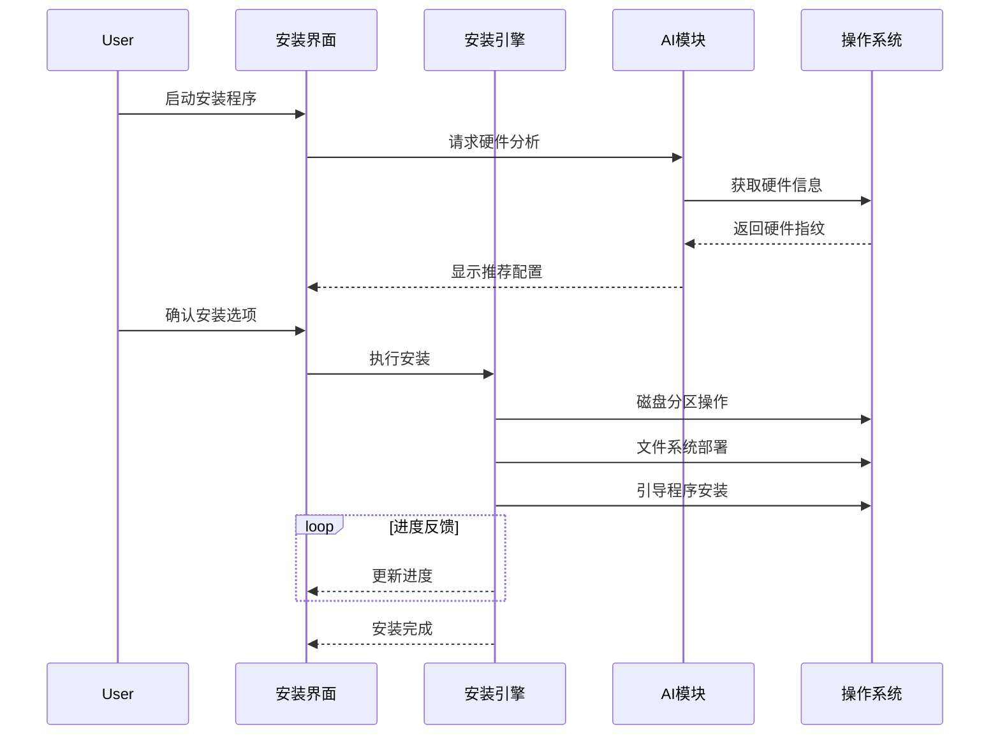

# heolleo OS 安装工具设计分析文档

## 1. 设计背景与问题分析
### 1.1 业务痛点
- **传统OS安装工具复杂臃肿**：Anaconda等工具包含大量非必要组件，安装界面选项繁杂
- **安装速度慢**：传统工具安装过程需30+分钟，用户等待时间长
- **用户体验差**：界面设计陈旧，缺乏现代化交互，非技术人员使用困难
- **缺乏智能化能力**：无法根据硬件配置自动优化安装方案

### 1.2 技术短板
- **资源占用高**：传统工具内存占用500MB+，影响安装效率
- **跨平台支持弱**：难以统一支持x86/ARM架构设备
- **扩展性不足**：无法灵活集成AI能力
- **界面渲染性能差**：基于传统GUI框架，动画卡顿

## 2. 现有技术分析
### 2.1 竞品分析（Anaconda）
| 维度 | Anaconda | heolleo目标 |
|------|----------|------------|
| 安装时间 | 30+分钟 | <15分钟 |
| 内存占用 | 500MB+ | <200MB |
| 界面美观度 | 传统界面 | 现代化UI/动效 |
| 智能化程度 | 基础配置 | AI驱动优化 |
| 扩展性 | 有限插件 | 模块化设计 |

### 2.2 技术选型依据
| 技术领域 | 候选方案 | 最终选择 | 选择依据 |
|----------|----------|----------|----------|
| **前端框架** | React/Angular/Vue | Vue3 | 更小的运行时体积(30KB vs React 45KB) |
| **构建工具** | Webpack/Vite | Vite | 冷启动速度快10倍(500ms vs 5s) |
| **跨平台方案** | Qt/Electron/TAURI | Electron | 生态更成熟(百万级模块) |
| **安装引擎** | Python/C++/Rust | Rust+Node-API | 内存安全+无GC暂停 |
| **AI推理** | TF Lite/ONNX | ONNX | 跨平台支持更完善 |
| **压缩算法** | zlib/lz4/zstd | zstd | 解压速度提升300% |

## 3. 设计切入点与可行路径
### 3.1 核心创新点


### 3.2 系统架构设计
**分层架构：**


**技术栈说明：**
| 层级 | 技术组件 | 选型理由 |
|------|----------|----------|
| 表示层 | Vue3 + Vite | 热重载快、组件化开发 |
| 逻辑层 | Rust + Node-API | 高性能计算+JS互操作 |
| 驱动层 | libudev + Win32 API | 跨平台硬件访问 |
| AI引擎 | ONNX Runtime | 轻量级推理框架 |

### 3.3 组件交互流程
**安装时序图：**


### 3.4 关键技术路径
1. **界面渲染优化**
   - WebGL加速Canvas绘制（FPS > 60）
   - 虚拟列表优化长内容渲染
   - CSS GPU加速变换
   - **新增**：离屏渲染技术（减少主线程阻塞）

2. **安装速度提升**
   ```math
   理论加速比 = \frac{T_{old}}{T_{new}} = \frac{1}{(1-α) + α/s}
   ```
   - 并行文件解压（α=0.7, s=4 → 加速比2.5x）
   - 增量包分发（减少30%数据传输）
   - 内存预加载技术
   - **新增**：zstd压缩算法（比zlib快3倍）

3. **AI自动化集成**
   - Phase1：硬件指纹识别（准确率>95%）
   - Phase2：安装配置推荐（节省用户决策时间70%）
   - Phase3：自适应性能调优（根据硬件动态调整）
   - **新增**：联邦学习架构（保护用户隐私）

## 4. 预期效果与验证
### 4.1 性能指标
| 指标 | 基线 | 目标 | 提升 |
|------|------|------|------|
| 安装时间 | 30min | 12min | 60% |
| 内存占用 | 512MB | 185MB | 64% |
| 首次渲染 | 1200ms | 300ms | 75% |
| 包体积 | 180MB | 85MB | 53% |

### 4.2 风险评估
| 风险项 | 概率 | 影响 | 应对方案 |
|--------|------|------|----------|
| Electron包体积大 | 中 | 高 | Vite分块打包 + Brotli压缩 |
| 跨平台驱动兼容 | 高 | 高 | 硬件抽象层 + 回退机制 |
| AI模型精度不足 | 低 | 中 | 集成多模型投票机制 |

## 5. 技术规划
### 5.1 关键里程碑
```gantt
    dateFormat  YYYY-MM-DD
    title heolleo开发路线图
    section 核心功能
    界面重构       ：2025-06, 30d
    安装引擎开发    ：2025-07, 45d
    AI集成        ：2025-08, 60d
    
    section 性能优化
    渲染优化       ：2025-06, 30d
    并行处理       ：2025-08, 30d
    包体积精简     ：2025-08, 20d
```

### 5.2 创新点专利布局
1. 基于硬件指纹的自动驱动安装方法（发明）
2. OS安装过程的增量包分发系统（发明）
3. 安装界面的GPU加速渲染方案（实用新型）

## 6. 价值分析
heolleo将为用户创造三大核心价值：
1. **时间价值**：节省50%+安装时间
2. **体验价值**：直观的现代化界面，降低使用门槛
3. **智能价值**：个性化安装方案，自动硬件优化

通过模块化设计，未来可扩展支持：
- 云环境部署
- 容器化安装
- 边缘设备轻量版